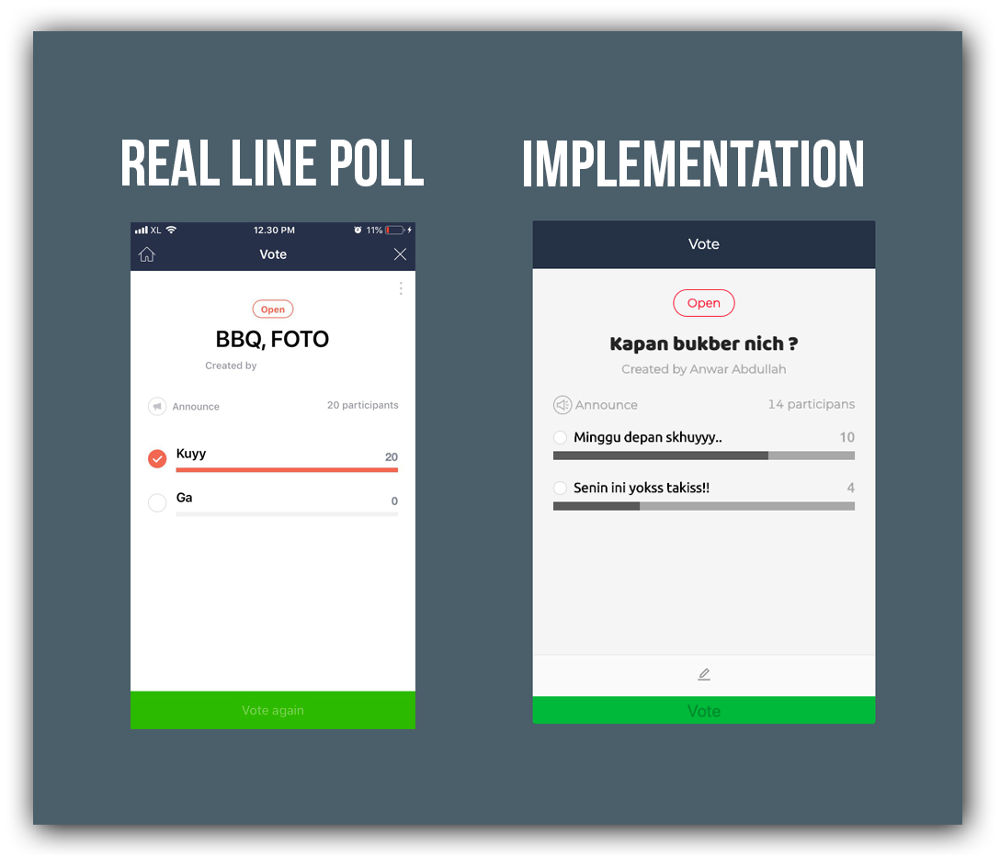

<!-- markdownlint-disable MD033 -->
<div align="center">

# True Winner - [React](https://reactjs.org/)
[](https://travis-ci.org/joemccann/dillinger) [](https://www.npmjs.com/package/react)   


## Simple LINE Poll Clone  ✨

<div align="left">

### About
True Winner is Simple Polling Apps inspired by [LINE](https://line.me/en/) Poll. User able to do duplicate vote. Using Session Storage to store the data. This project was bootstrapped with [Create React App](https://github.com/facebook/create-react-app). This Project also have implement [Redux-Saga](https://github.com/redux-saga/redux-saga) for state management.

You cant do online test for this repo [Here](https://true-winner.herokuapp.com/). ✨
``` please refresh if you find an aplication error ```

</div>



</div>

### Installation
This Repo requires [Node.js](https://nodejs.org/) to run.

Install the dependencies and devDependencies and start the server.

```sh
$ git clone "this-repo"
$ cd "this-repo"
$ npm install 'or' yarn install
$ npm run start 'or' yarn start
```

### Tech
This repo uses a number of open source projects to work properly:
* [antd](https://ant.design/)
* [classnames](https://www.npmjs.com/package/classnames/)
* [Redux](https://github.com/reduxjs/redux)
* [Redux Saga](https://redux-saga.js.org/)
* [Node Sass](https://npmjs.org/package/node-sass/)

### How to Use
 - Choose Options
 - Click Vote Button

### License

    MIT License

    Copyright (c) 2019 Anwar Abdullah

    Permission is hereby granted, free of charge, to any person obtaining a copy
    of this software and associated documentation files (the "Software"), to deal
    in the Software without restriction, including without limitation the rights
    to use, copy, modify, merge, publish, distribute, sublicense, and/or sell
    copies of the Software, and to permit persons to whom the Software is
    furnished to do so, subject to the following conditions:

    The above copyright notice and this permission notice shall be included in all
    copies or substantial portions of the Software.

    THE SOFTWARE IS PROVIDED "AS IS", WITHOUT WARRANTY OF ANY KIND, EXPRESS OR
    IMPLIED, INCLUDING BUT NOT LIMITED TO THE WARRANTIES OF MERCHANTABILITY,
    FITNESS FOR A PARTICULAR PURPOSE AND NONINFRINGEMENT. IN NO EVENT SHALL THE
    AUTHORS OR COPYRIGHT HOLDERS BE LIABLE FOR ANY CLAIM, DAMAGES OR OTHER
    LIABILITY, WHETHER IN AN ACTION OF CONTRACT, TORT OR OTHERWISE, ARISING FROM,
    OUT OF OR IN CONNECTION WITH THE SOFTWARE OR THE USE OR OTHER DEALINGS IN THE
    SOFTWARE.