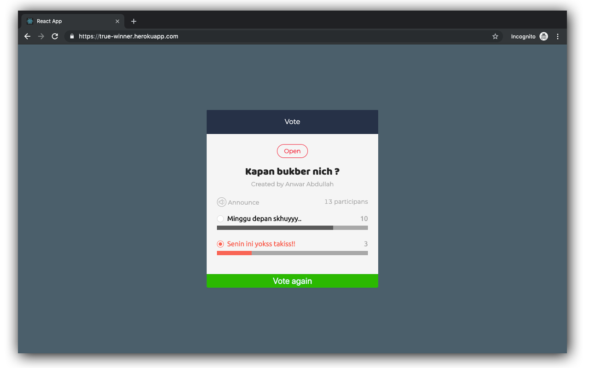

<!-- markdownlint-disable MD033 -->
<div align="center">

# True Winner - [React](https://reactjs.org/)
[](https://travis-ci.org/joemccann/dillinger) [](https://www.npmjs.com/package/react)   


## Simple LINE Poll Clone  ✨
You cant do online test for this repo [Here](https://true-winner.herokuapp.com/).



</div>

### Installation

This Repo requires [Node.js](https://nodejs.org/) to run.

Install the dependencies and devDependencies and start the server.

```sh
$ git clone "this-repo"
$ cd "this-repo"
$ npm install || yarn install
$ npm run start || yarn start
```

### Tech

This repo uses a number of open source projects to work properly:
* [antd](https://ant.design/)
* [classnames](https://www.npmjs.com/package/classnames/)
* [Redux](https://github.com/reduxjs/redux)
* [Redux Saga](https://redux-saga.js.org/)
* [Node Sass](https://npmjs.org/package/node-sass/)

### How to Use
 - Click on the card 'add new topic' for add new topic
 - Click thumbs up green icon for up vote the topic
 - Click thumbs down red icon for down vote the topic

License
----
MIT
